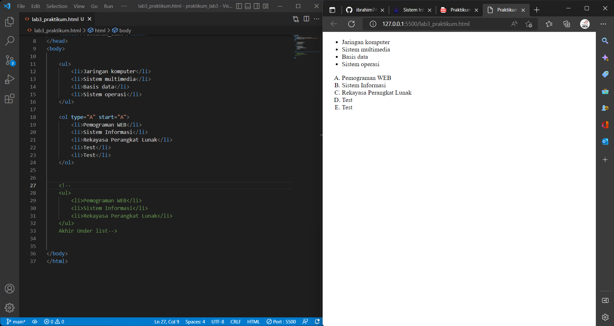
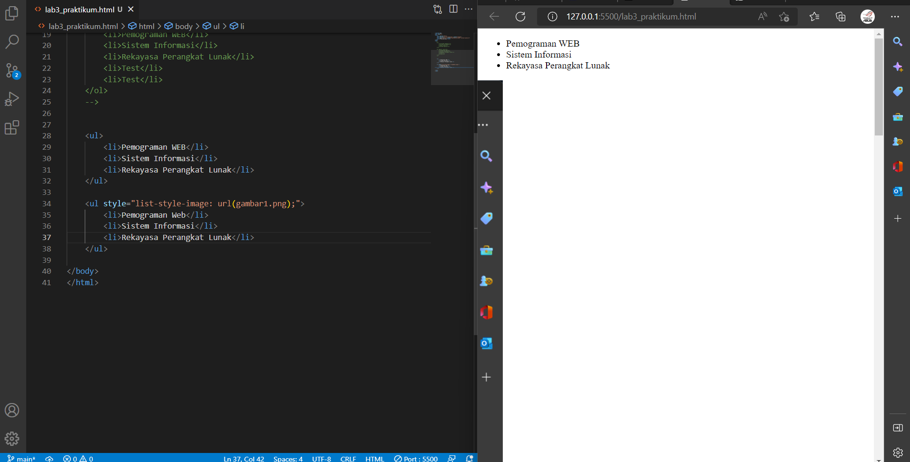
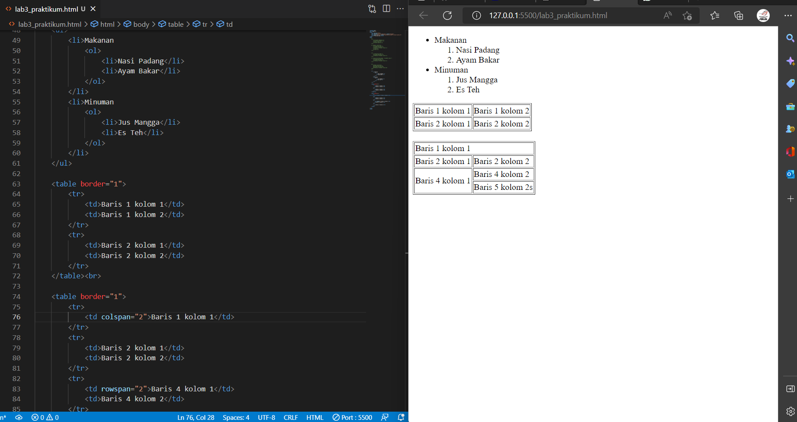
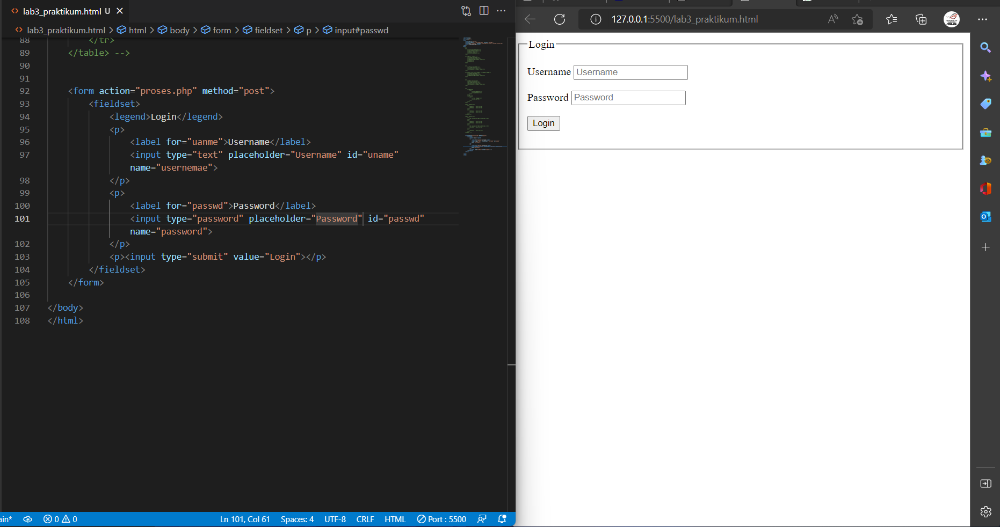
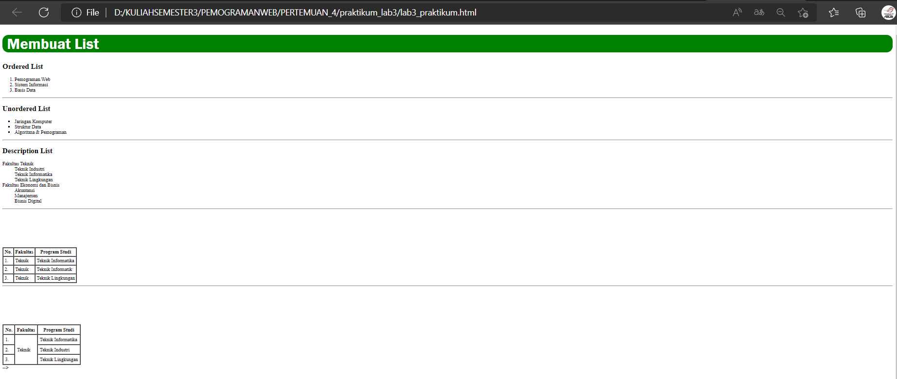

# pratikum_lab3

## Menambahkan Image dari hasil codingan

menambahakan Gambar 1
# Gambar 1

menambahkan `Gambar 2`
# Gambar 2

menambahakan `Gambar 3`
# Gambar 3

menambahkan `Gambar 4`
# Gambar 4

menambahkan `Gambar 5`
# Gambar 5

menambahkan `Gambar 6`
# Gambar 6
